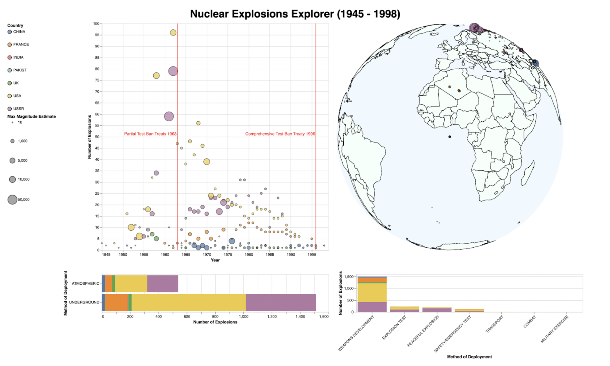

# Nuclear Explosions Data Visualisation Tool

<<<<<<< HEAD

=======

>>>>>>> 5cd373dd7fb083d1d96a848733db45bb014882c6

This tool enables the exploration of data of all recorded Nuclear Explosions detonated between 1945-1998. 

This visualisation tool was built using Vega Lite and can be implemented by copying and pasting the nuclearExplosionsTool.json into the vega lite editor.

Details about the data used, visual explorer design and tool interaction can be found [here](InfoVis_Assignment3/visualExplorationToolDesignDocument.pdf). 
